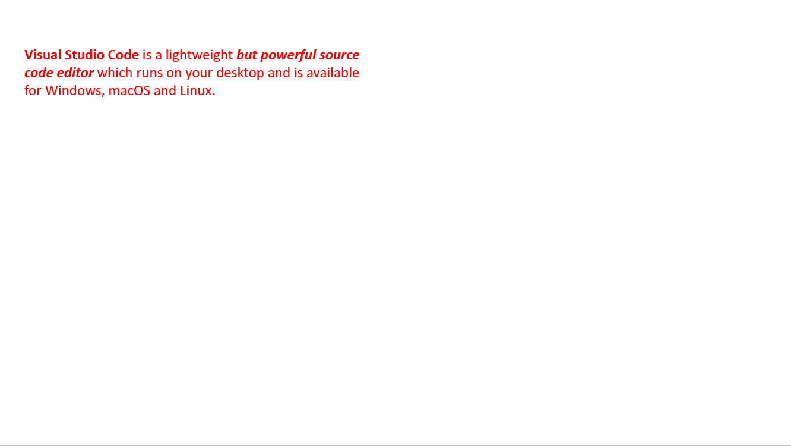

# ppt-parser



```
"powerPointElements": [
    {
      "name": "TextBox7",
      "shapeType": "rect",
      "specialityType": "None",
      "elementPosition": {
        "x": "283335",
        "y": "669701"
      },
      "elementOffsetPosition": {
        "cx": "5589431",
        "cy": "923330"
      },
      **"paragraph"**: {
        **"text"**: "Visual Studio Code is a lightweight but powerful source code editor which runs on your desktop and is available for Windows, macOS and Linux.",
        "textCharacterProperties": {
          "size": 1200,
          "fontAttributes": [
            0
          ],
          "font": "Helvetica",
          "fillColor": "FF0000"
        },
        "paragraphProperties": {
          "alignment": "left"
        }
      },
      **"shape"**: {
        "fill": {
          "fillType": "Solid",
          "fillColor": "00FFFFF"
        },
        "border": null,
        "opacity": 0
      },
      **"links"**: null,
      **"raw"**: {
        "p:nvSpPr": [
          {
            "p:cNvPr": [
              {
                "$": {
                  **"id"**: **"8"**, //8번째 슬라이드
                  "name": "TextBox 7"
                },
                "a:extLst": [
                  {
                    "a:ext": [
                      {
                        "$": {
                          "uri": "{FF2B5EF4-FFF2-40B4-BE49-F238E27FC236}"
                        },
                        "a16:creationId": [
                          {
                            "$": {
                              "xmlns:a16": "http://schemas.microsoft.com/office/drawing/2014/main",
                              "id": "{5723A292-39A1-2B4D-93C0-B986547B2CA0}"
                            }
                          }
                        ]
                      }
                    ]
                  }
                ]
              }
            ],
            "p:cNvSpPr": [
              {
                "$": {
                  "txBox": "1"
                }
              }
            ],
            "p:nvPr": [
              ""
            ]
          }
        ],
        "p:spPr": [
          {
            "a:xfrm": [
              {
                "a:off": [
                  {
                    "$": {
                      "x": "283335",
                      "y": "669701"
                    }
                  }
                ],
                "a:ext": [
                  {
                    "$": {
                      "cx": "5589431",
                      "cy": "923330"
                    }
                  }
                ]
              }
            ],
            "a:prstGeom": [
              {
                "$": {
                  "prst": "rect"
                },
                "a:avLst": [
                  ""
                ]
              }
            ],
            "a:noFill": [
              ""
            ]
          }
        ],
        "p:txBody": [
          {
            "a:bodyPr": [
              {
                "$": {
                  "wrap": "square",
                  "rtlCol": "0"
                },
                "a:spAutoFit": [
                  ""
                ]
              }
            ],
            "a:lstStyle": [
              ""
            ],
            "a:p": [
              {
                "a:r": [
                  {
                    "a:rPr": [
                      {
                        "$": {
                          "lang": "en-US",
                          **"b"**: "1", //굵게
                          "dirty": "0"
                        },
                        "a:solidFill": [
                          {
                            "a:srgbClr": [
                              {
                                "$": {
                                  "val": "FF0000"
                                }
                              }
                            ]
                          }
                        ]
                      }
                    ],
                    **"a:t"**: [
                      "Visual Studio Code"
                    ]
                  },
                  {
                    "a:rPr": [
                      {
                        "$": {
                          "lang": "en-US",
                          "dirty": "0"
                        },
                        "a:solidFill": [
                          {
                            "a:srgbClr": [
                              {
                                "$": {
                                  "val": "FF0000"
                                }
                              }
                            ]
                          }
                        ]
                      }
                    ],
                    "a:t": [
                      "is a lightweight"
                    ]
                  },
                  {
                    "a:rPr": [
                      {
                        "$": {
                          "lang": "en-US",
                          **"b"**: "1", //굵게
                          **"i"**: "1", //기울임
                          "dirty": "0"
                        },
                        "a:solidFill": [
                          {
                            "a:srgbClr": [
                              {
                                "$": {
                                  "val": "FF0000"
                                }
                              }
                            ]
                          }
                        ]
                      }
                    ],
                    **"a:t"**: [
                      "but powerful source code editor"
                    ]
                  },
            ]
          }
        ]
      }
    }
  ],
  "inputPath": "./sample.pptx"
```
